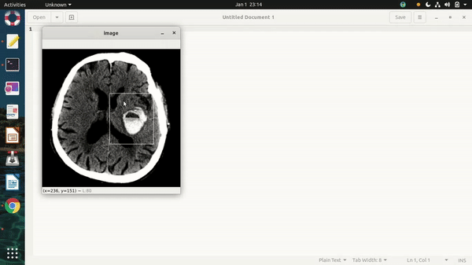
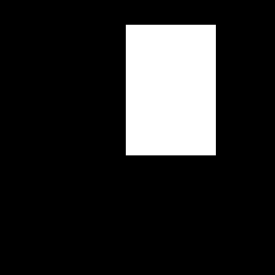
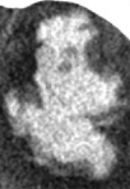
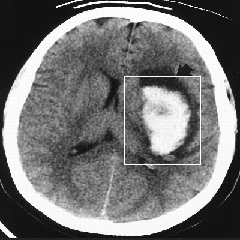
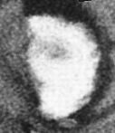

# Interactive-Semi-Automatic-Image-2D-Bounding-Box-Annotation-Tool-using-Multi-Template_Matching

 An Interactive Semi Automatic Image 2D Bounding Box Annotation/Labelling Tool to aid the Annotater/User to rapidly create 2D Bounding Box Single Object Detection masks for large number of training images in a semi automatic manner in order to train an object detection deep neural network such as Mask R-CNN or U-Net. As the Annotater/User starts annotating/labelling by drawing a bounding box for a few number of images in the selected folder then the algorithm suggests bounding box predictions for the rest of the yet to be annotated/labelled images in the folder. If the predictions are right then the user/annotater can simply press the keyboard key 'y' which indicates that the detected bounding box is correct. If the prediction is wrong then the user/annotater can manually draw a rectangular 2D bounding box over the correct ROI (Region of interest) in the image and then press the key 'y' to proceed further to the rest of the images in the folder. If the user/annotater made a mistake while drawing the 2D bounding box, then he/she can press the key 'n' in order to remove the incorrectly marked 2D bounding box and he/she can repeat the process for the same image until he/she draws the correct 2D bounding box and then after drawing the correct 2D bounding box, the user/annotater may press the key 'y' to continue to the rest of the images. The 2D bounding box prediction over the whole image data set improves as the user/annotater annotates/labels more number of images by drawing 2D bounding boxes. This tool allows the user/annotater to not only interactively and rapidly annotate large number of images but also to validate the predictions at the same time interactively. This tool helps the user/annotater to save a lot of time when annotating/labelling and validating the predictions for a large number of training images in a folder.  
 
 
 
 
 
 
 
 
 
 

 Instructions to use:-  
 
 1. If the training images are in JPEG or any other format, then convert them to PNG format using some other tool or program before using these images for annotation.  
 
 2. All the training images must contain the object of interest which is to be annotated.  
 
 3. Currently the application only supports 2D bounding box annotation for single object detection per image, but in the future semantic segmentation based annotation features will be added which will allow precise boundary segmentation masks of an object in an image.   
 
 4. If some or all of the training images have varying dimensions(shapes/resolutions), then resize them to the same dimensions using this tool by providing the height and width to which all the training images need to be resized to. The height and width are inputed separately in two different dialog boxes which pop up once the program is executed. If the training images need not be resized then press the cancel button in the dialog boxes requesting the height and width.
 
 5. Select the folder containing the training images by navigating to the folder containing the training images through a dialog box which pops up after the program is executed. If the images need to be resized then two dialog boxes pop up. The first dialog box is to navigate to the destination folder containing the unresized raw training images and after resizing another dialog box pops up to navigate to the folder containing the saved resized training images named as "resized_data". If the images need not be resized then only one dialog box pops up so that the user can navigate to the raw training images folder directly.  
 
 6. The images in the folder pop up one by one. After drawing the correct 2D bounding box over the ROI (region of Interest), press the 'y' key. Except the first image, the rest of the images will have a 2D bounding box drawn over them. If the predicted box is accurate, then continue by pressing the 'y' key. If the prediction is incorrect, then draw the accurate bounding box and press the 'y' key. If any mistake occured while drawing the 2D box, then reset the image by removing the incorrect drawing by pressing the 'n' key and then redraw the correct box and finally press the 'y' key.  
 
 7. The output images are stored in four different folders in the same directory containing the training images folder. The four folders contain the black and white mask images, raw training images, raw training images with rectangular boxes drawn over them and finally the cropped templates.
